# Project Setup

This project consists of multiple services running via Docker and Docker Compose. Follow the steps below to start the containers.
The aim is to use Kafka to ingest data from different sensors and then use airflow to process the data and store it in a database. 
The backend service generates reports and analytics based on data processed through the Airflow pipelines.

## Prerequisites

- Ensure **Docker** and **Docker Compose** are installed.
- Tested on **Windows 11 with WSL2, Ubuntu 24.04, Docker Desktop and using Git Bash**.

## Starting the Containers

### 1. Infrastructure Services

Navigate to the `infra` directory and start the required services:

```bash
cd infra
docker compose up -d
```

This will start **MySQL, Kafka, Zookeeper, Airflow**, and their respective UIs.

Create an Airflow user:

'docker exec -it airflow airflow users create -e admin@gmail.com -f Admin -l User -p secret -r Admin -u root'

#### Credentials & UI Access:
- **Airflow**: [http://localhost:8082](http://localhost:8082) 
  - User: `root`  | Password: `secret`

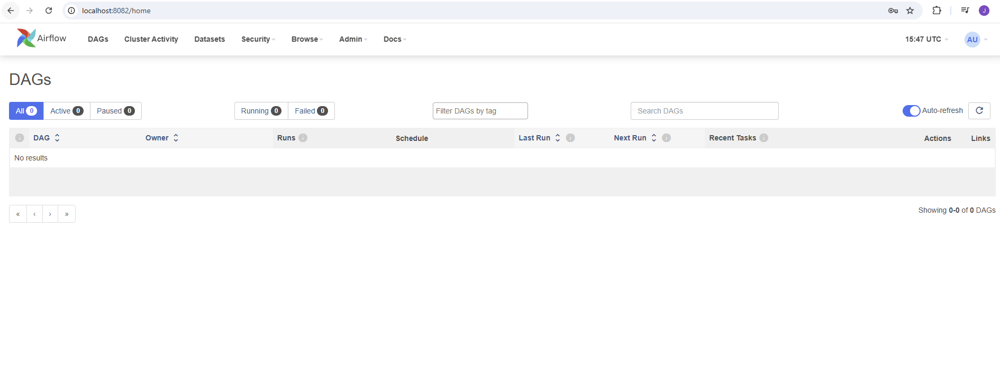

- **MySQL**: [http://localhost:8081](http://localhost:8081)
  - User: `root`  | Password: `secret`

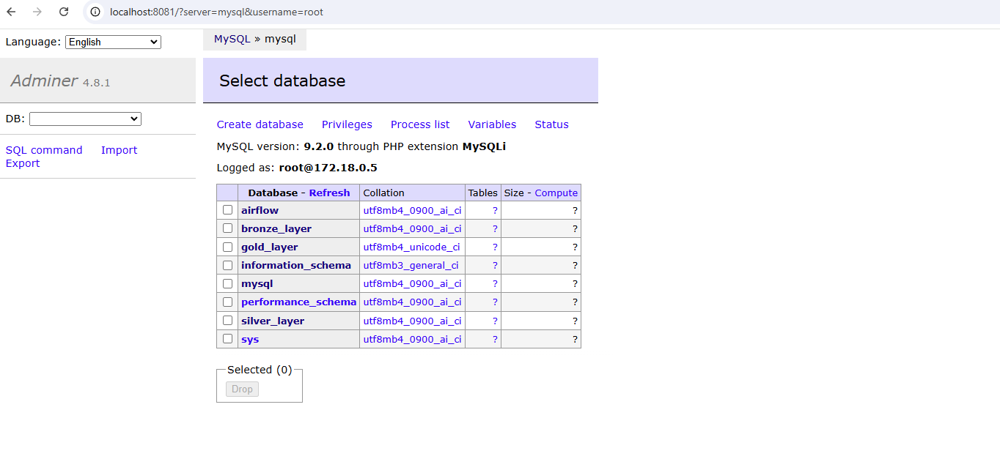

- **Kafka UI**: [http://localhost:8080](http://localhost:8080)

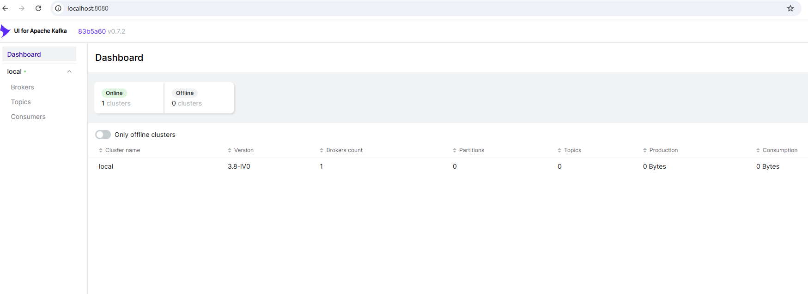


### 2. Producer Service

Once the infrastructure is running, start the **Producer Service**:

```bash
cd ../producer
docker compose up -d
```

This service initializes Kafka topics and allows data ingestion.

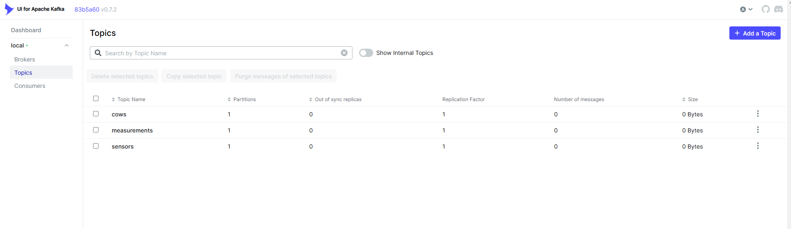

#### Populate Kafka Topics:
```bash
./producer_seeders.sh
```
This script reads **parquet files** from the `data` directory and sends them to Kafka topics:
- `data/cows`
- `data/measurements`
- `data/sensors`

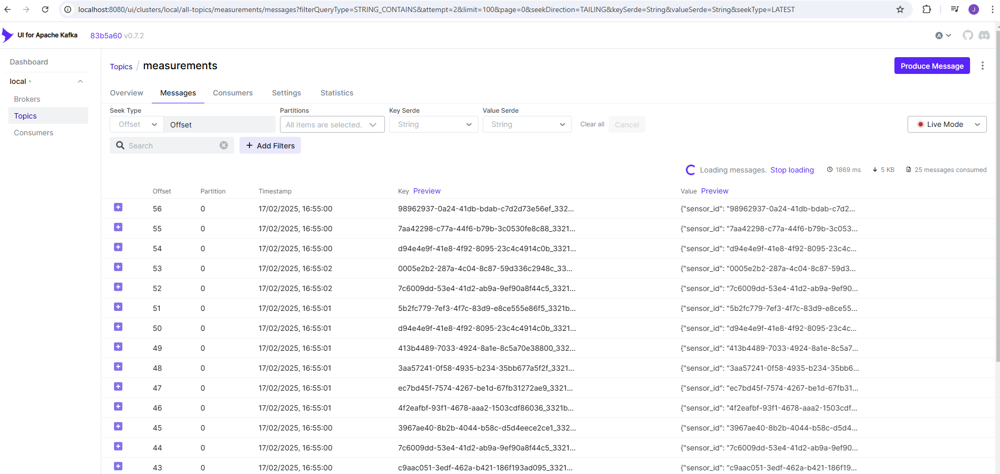

***Notice:** Measurements take a while to become available in Kafka topics. Nevertheless, the remaining steps can be executed.

Endpoints for ingestion:
- `POST http://localhost:5001/cow`
- `POST http://localhost:5001/ingrid/measurement`
- `POST http://localhost:5001/ingrid/sensor`

Check API documentation at [http://localhost:5001/docs](http://localhost:5001/docs).

### 3. Pipeline Service

The **Pipeline Service** processes Kafka data and organizes it into layers:
- **Kafka Consumer**: Reads Kafka data and stores it in the raw layer.
- **Airflow DAGs**: Process data into silver and gold layers.

#### Load Data into Raw Layer:
```bash
./consumer_seeder.sh
```
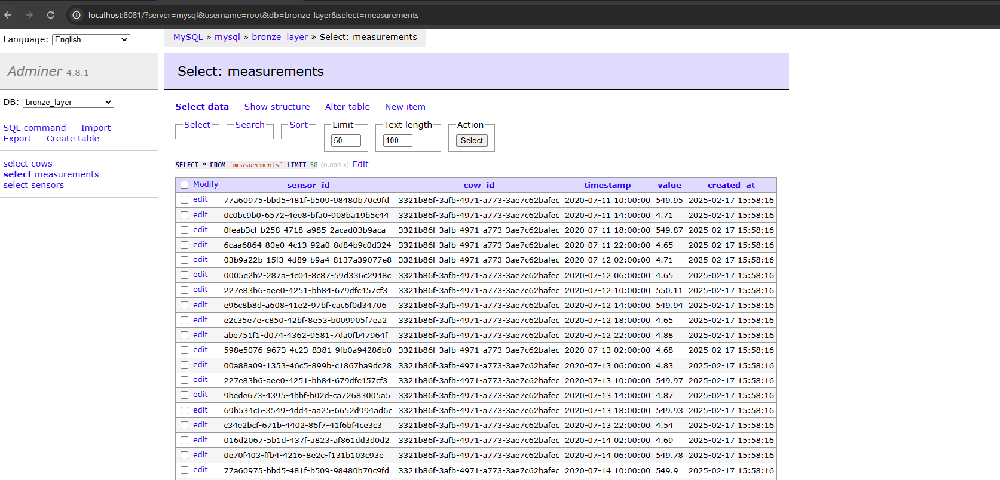

#### Deploy Pipeline Scripts to Airflow:
```bash
./update_dags.sh
```

**Notice:** The new DAGs take a while to be available in the Airflow UI.

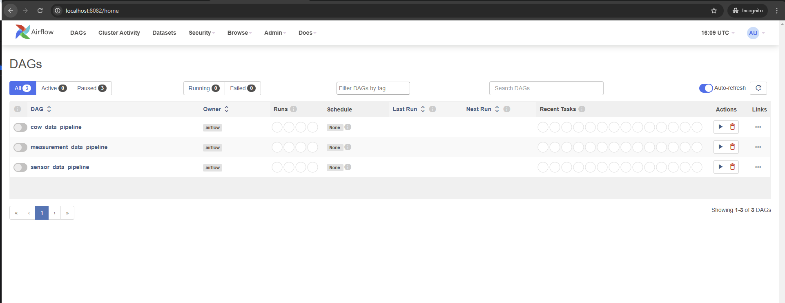

Run DAGs via **Airflow UI**: [http://localhost:8082](http://localhost:8082)

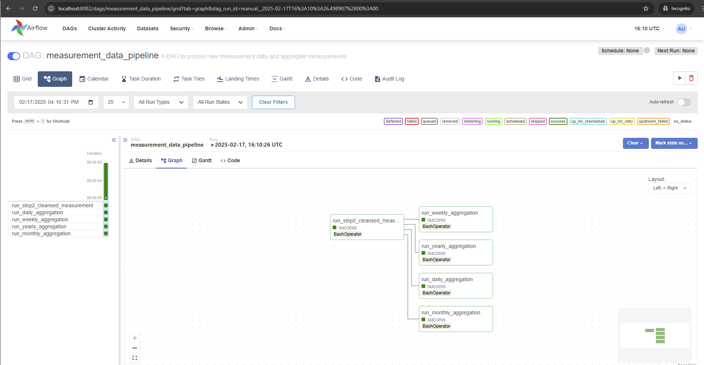

After running the 3 DAGs, the data will be available in **MySQL** in the **gold** layer. 
The gold layer is used by the **Backend Service** to generate the reports.

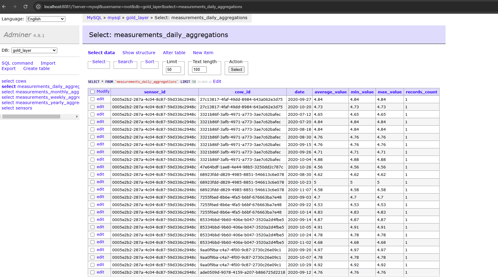

### 4. Backend Service

Finally, start the **Backend Service**:

```bash
cd ../back-end
docker compose up -d
```

#### API Access:
- Base URL: [http://localhost:5000/](http://localhost:5000/)
- API Docs: [http://localhost:5000/docs](http://localhost:5000/docs)

#### Key Endpoints:
- `GET /cows/{cow_id}` - Retrieve cow data with latest sensor info.
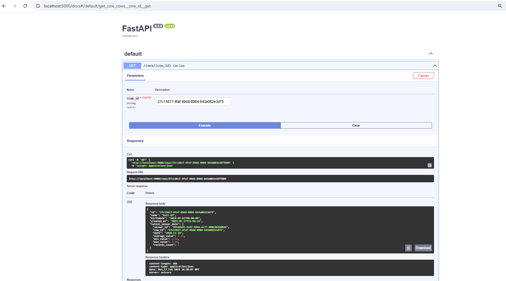

- `POST /cows/` - Create a new cow.
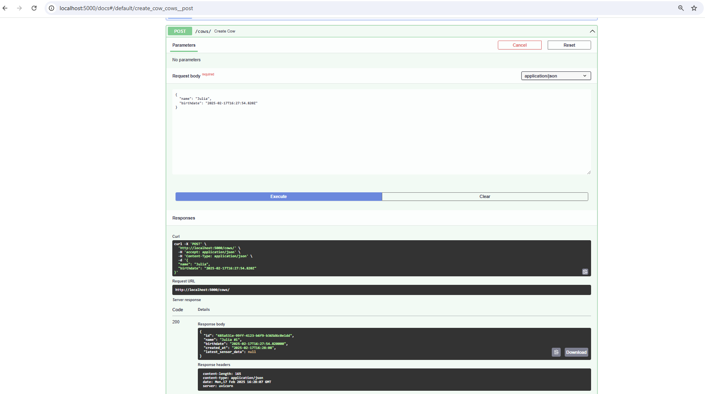

- `GET /generate-report/{report_date}` - Generate a report for the given date.
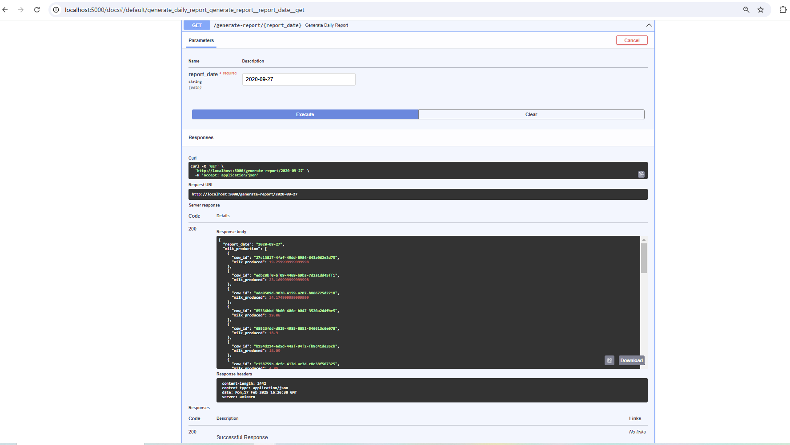

There is a shell script to run the tests:

```bash
./run_tests.sh
```

This will run the tests from the `back-end` service.

## Stopping the Containers

To stop all services, run in each directory:
```bash
docker compose down
```
To remove all data and images in each directory:
```bash
docker compose down -v --rmi all
```

# TODOs for the Project

## General TODOs
1. **Documentation**:
   - Add docstrings to all functions and classes to improve code readability and maintainability.

2. **Logging**:
   - Implement a more generic logging system to log messages from all services.

3. **Error Handling**:
   - Improve error handling in all scripts.

## Pipelines
1. **Configuration Management**:
   - Sensitive information (such as database passwords) should be stored in a secure configuration management system.
   - Create a centralized configuration file for managing all configurations (e.g., database, Kafka) instead of hardcoding them into scripts.

2. **Data Validation**:
   - Implement more robust data validation in the `step2_cleansed_*` scripts to handle edge cases and unexpected data formats.

3. **Testing**:
   - Write unit tests for all critical functions and classes, especially for data processing and validation logic.
   - Implement integration tests to ensure that the entire data pipeline works as expected.

4. **DAG Management**:
   - Create a mechanism to dynamically manage and update Airflow DAGs without manual intervention.
   - Add error handling in the DAG tasks to ensure that failures are logged and retried appropriately.

5. **Performance Monitoring**:
   - Integrate performance monitoring tools to track the response times and resource usage of the pipelines services.
   - Set up alerts for critical failures.
   
## Producer
1. **API Enhancements**:
   - Add more detailed error responses for the API to help clients understand what went wrong.

3. **Kafka Topic Management**:
   - Implement a method to delete or modify existing Kafka topics if needed.

## Infra
1. **Docker Optimization**:
   - Optimize Dockerfiles by reducing the number of layers.
   - Ensure that all services are using the latest stable versions of their dependencies.

2. **Tooling**:
    - Migrate to Cloud Services or Kubernetes to manage the infrastructure.
    - An improved version of this setup could follow this diagram excluding the stream processing section (Parts 2 and 3) in the diagram.
      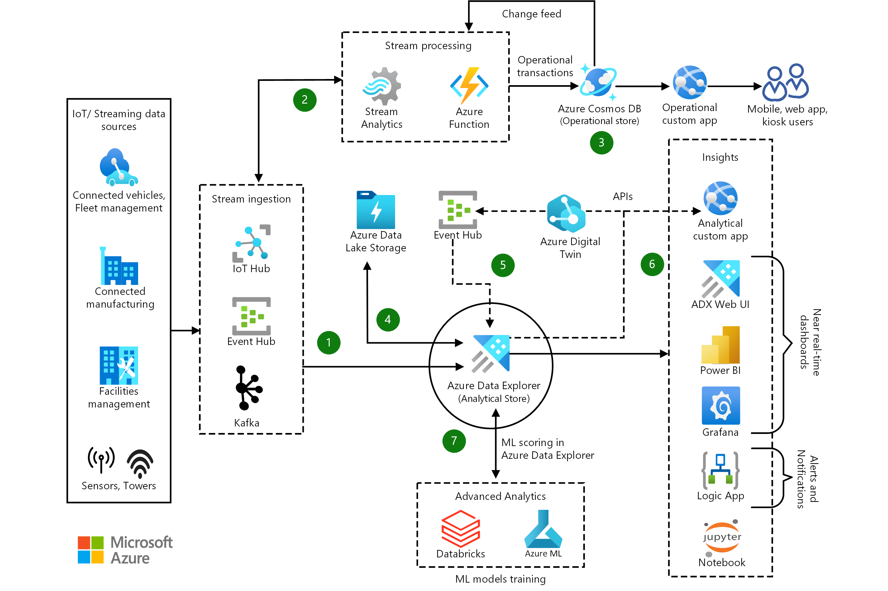

## Back-end
1. **API Versioning**:
   - Document the API endpoints and their expected inputs/outputs.

2. **Performance Monitoring**:
   - Integrate performance monitoring tools to track the response times and resource usage of the backend services.
   - Set up alerts for critical failures or performance degradation.

3. **Security Enhancements**:
   - Implement authentication and authorization for the API endpoints to secure access.